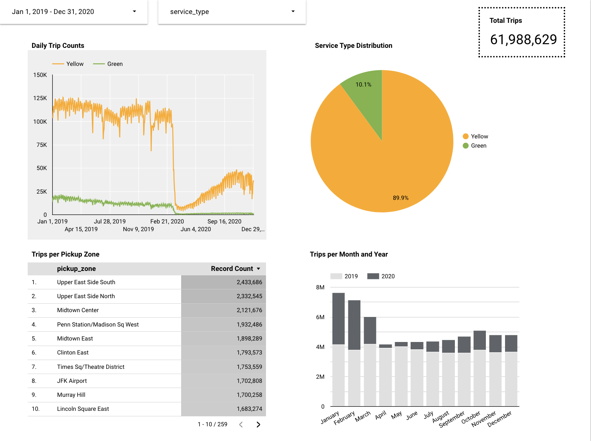

# GCP Infrastructure and Data Pipeline Setup

This directory contains Terraform scripts and additional configuration files designed to deploy a comprehensive data pipeline on Google Cloud Platform (GCP). The infrastructure and services set up by this code are tailored for data ingestion and processing, utilizing several GCP services along with Docker and Airflow for orchestration.

## Overview

The code automates the following tasks:

- **Google Cloud Storage Bucket Creation**: Sets up a Google Cloud Storage bucket intended for storing source data. This bucket serves as the initial landing spot for data before it is processed and analyzed.

- **Virtual Machine Deployment**: Deploys a Google Compute Engine (GCE) virtual machine. This VM is the central node for running Docker Compose which hosts the Airflow service.

- **Airflow Setup via Docker Compose**: Configures and launches Airflow within the deployed VM using Docker Compose. Airflow is used to orchestrate data ingestion workflows which is written in a python DAG script, automating the process of fetching data and pushing it into the designated storage bucket.

- **Data Ingestion Triggering**: Executes a bash script to trigger Airflow DAG for multiple months of data files.

- **BigQuery Dataset Setup**: The terraform scripts also prepares a BigQuery dataset and creates external tables once the source data is available in the storage bucket. 

## Workflow

1. **Infrastructure Initialization**: The Terraform script sets up the necessary GCP resources, including the storage bucket for raw data, the compute instance for running Airflow DAG, and the BigQuery dataset facilitating the creation of exteranl table for analysis.

2. **Airflow Configuration**: Through Docker Compose, Airflow is set up on the VM, ready to manage the data ingestion workflows defined by the user.

3. **Data Ingestion and Storage**: Bash scripts trigger Airflow to ingest data, which is then pushed to the Google Cloud Storage bucket, serving as a repository for raw data.

## Learning
[TODO]

